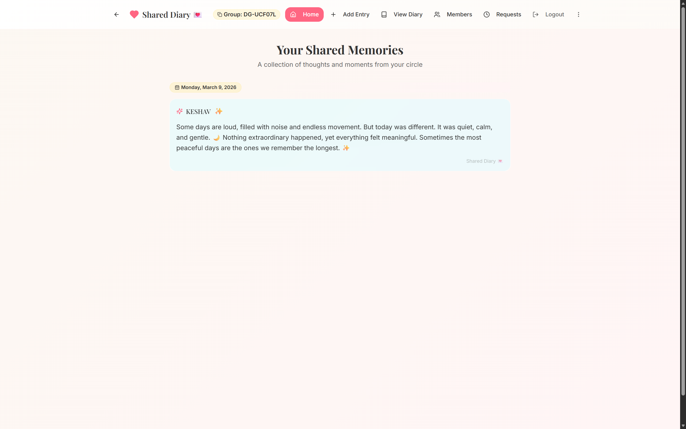
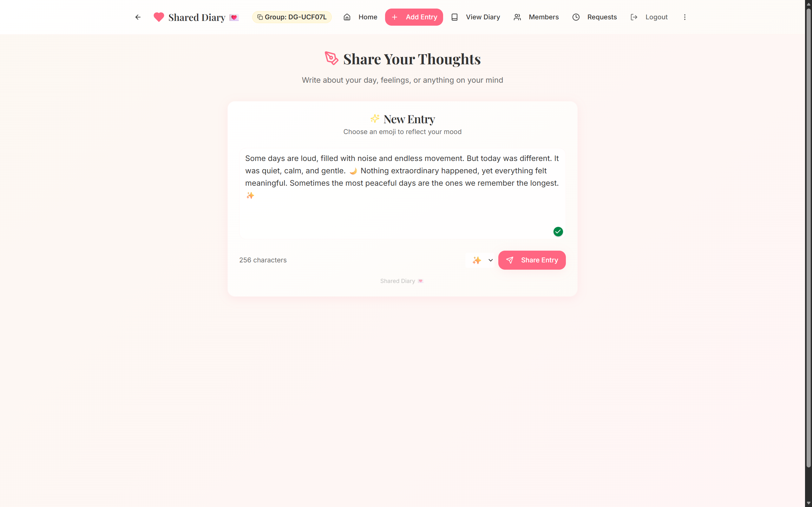
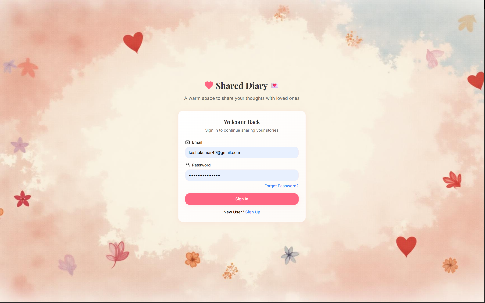
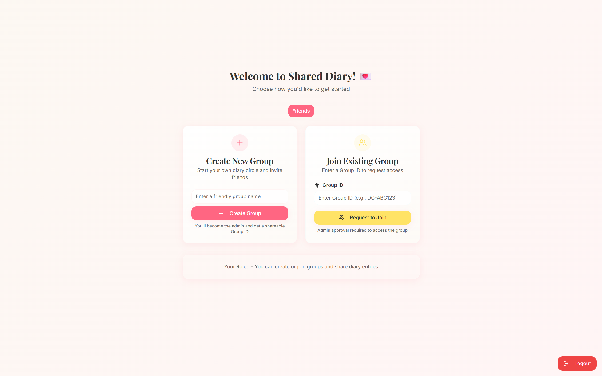

# 💌 Shared Diary Web App

<p align="center">
A private collaborative diary for sharing thoughts and memories with trusted friends.
</p>

<p align="center">

[](https://shared-diary-app.vercel.app/)


</p>

<p align="center">


</p>

A **private collaborative diary platform** that allows close friends or small groups to record and share personal thoughts in a secure digital space.

The application focuses on **privacy, simplicity, and a warm user experience**, enabling members of a trusted group to write and read diary entries together.

🔗 **Live Application:**  
https://shared-diary-app.vercel.app/

---

# 📖 Project Overview

The **Shared Diary Web App** is a secure web platform where a small group of users can maintain a shared digital diary.

Unlike traditional social media platforms, this application is designed for **private and trusted circles**, where users can express thoughts and memories without public exposure.

Each diary entry is stored securely in **Firebase Firestore** and organized by **date and author**, creating a timeline of shared memories.

Access to the diary is controlled through an **admin approval system**, ensuring that only trusted members can participate.

---

# 📸 Project Preview

### 🏠 Home Dashboard

<p align="center">

</p>

The main dashboard where users can quickly navigate the diary system.  
Members can access the timeline, create new diary entries, explore previous entries, and manage group interactions.

---

### 📖 Diary Timeline

<p align="center">

</p>

The shared diary timeline displays entries chronologically.  
Users can read thoughts and experiences written by other members of the group in a clean and organized journal interface.

---

### 🔐 Secure Login

<p align="center">

</p>

Users sign in securely using Firebase Authentication.  
Access to the diary is restricted until an administrator approves the account.

---

### 👥 Group Management

<p align="center">

</p>

Users can join private diary groups using a group ID.  
Administrators manage member approvals to ensure the diary remains private and accessible only to trusted users.

---

# ✨ Implemented Features

## 🔐 Secure Authentication

User authentication is handled using **Firebase Authentication**.

Features include:

* Email and password login
* Secure session management
* Admin-controlled access approval
* Restricted access for unapproved users

Only approved users can access diary entries and interact with the application.

---

## 👥 Member Approval System

To maintain privacy, the app includes an **admin approval flow**.

Workflow:

1. A user logs in to the platform.
2. The account remains **pending approval**.
3. An admin reviews and approves the user.
4. Once approved, the user gains access to the diary.

This ensures the diary remains **restricted to trusted members**.

---

## ✍️ Shared Diary Entries

Users can write and share diary entries that become part of a shared timeline.

Each entry contains:

* Author name
* Entry content
* Date of submission

Example Firestore structure:

```json
DiaryEntries: {
  "2025-09-21": {
    "Keshav": "Today felt quiet, I studied and rested peacefully."
  }
}
```

Entries are automatically grouped by **date**, creating a chronological journal.

---

## 📅 Timeline-Based Diary View

Diary entries are displayed through a **timeline-style interface**, allowing users to browse entries by day.

Features include:

* Chronological diary entries
* Author identification
* Clean reading layout
* Smooth navigation across entries

This provides a **journal-like reading experience**.

---

## 👥 Members Page

The application includes a **member listing interface** that displays all users in the diary circle.

Features include:

* Active members list
* Pending approval users
* Role indication (admin or member)
* Member join date

This helps maintain transparency within the group.

---

## 🔎 Entry Search & Filtering

Users can quickly locate past diary entries using built-in filters.

Supported search options:

* Filter entries by **author**
* Filter entries by **date**
* Navigate diary history efficiently

This becomes especially useful as the diary grows over time.

---

## 😊 Mood Tagging

Diary entries can include **mood-based emoji tags** to capture emotional context.

Examples:

| Mood       | Emoji |
| ---------- | ----- |
| Happy      | 😊    |
| Calm       | 🌙    |
| Excited    | 🎉    |
| Thoughtful | 🤔    |

Mood tagging makes the diary **more expressive and personal**.

---

# 🛠 Technology Stack

## Frontend

* **React.js**
* **TypeScript**
* **Tailwind CSS**
* **shadcn/ui components**

---

## Backend & Database

* **Firebase Authentication**
* **Cloud Firestore**

Used for:

* user authentication
* member approval
* diary entry storage
* real-time data updates

---

## Deployment

* **Vercel**

Live application:

[https://shared-diary-app.vercel.app/](https://shared-diary-app.vercel.app/)

---

# 🏗 System Architecture

```
User
 │
 ▼
React Frontend
 │
 ▼
Firebase Authentication
 │
 ▼
Cloud Firestore
 │
 ├── users
 │      └── userId
 │           ├── name
 │           ├── email
 │           └── approved
 │
 └── DiaryEntries
        └── date
             └── username
                  └── entryText
```

---

# 🔒 Security Model

The application protects diary privacy using multiple layers.

### Authentication

Only authenticated users can access the system.

### Admin Approval

Users must be approved by an administrator before accessing diary content.

### Firestore Security Rules

Database rules ensure:

* restricted data access
* authenticated writes
* controlled user permissions

---

# 🚀 Running the Project Locally

### 1️⃣ Clone the Repository

```bash
git clone <YOUR_GIT_URL>
cd shared-diary-app
```

---

### 2️⃣ Install Dependencies

```bash
npm install
```

---

### 3️⃣ Run Development Server

```bash
npm run dev
```

Application runs at:

```
http://localhost:5173
```

---

# 🔧 Firebase Setup

1. Create a **Firebase Project**
2. Enable **Authentication → Email/Password**
3. Enable **Cloud Firestore**
4. Create collections:

```
users
DiaryEntries
```

5. Add Firebase configuration in:

```
src/firebase.ts
```

---

# 🚧 Planned Enhancement

## 🤖 AI-Assisted Diary Writing

A future enhancement will introduce **AI-assisted diary refinement** using the **OpenAI API**.

This feature will help improve the clarity and tone of diary entries while preserving the original intent of the user.

The feature is currently **planned but not implemented**.

---

# 👨‍💻 Author

**Keshav**
B.Tech Computer Science & Engineering
Bennett University
